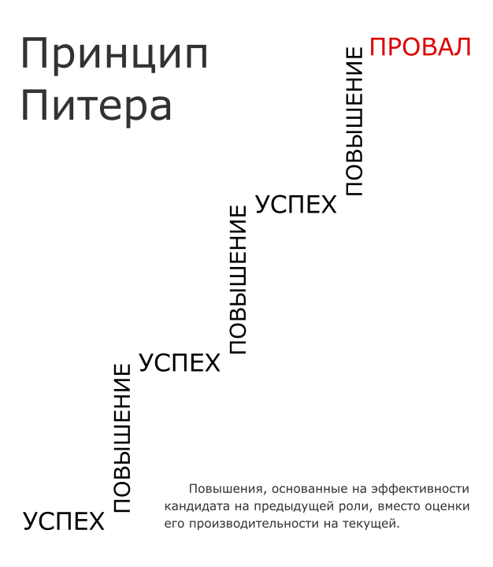

Идея кадрового резерва проста: мы берём заранее известного нам сотрудника организации, который уже много чего узнал об организации и её предметной области (это внутренний резерв) или наоборот – никак не связан текущим устаревшим знанием (это внешний резерв) – и двигаем его на свободную вакансию (масло масляное, ну да ладно) на более высокую должность в тот же момент, в который эта должность появляется. "Резерв" в том, что мы берём заранее известного сотрудника той же корпоративной культуры (если надо – внутренний резерв), или альтернативной (внешний резерв), а не ищем его в пожарном порядке.

Откуда появляются свободные вакансии? Причин много, но на всей цепочке chain of command регулярно кадровый голод:
* рост компании, открываются новые направления, ими надо рулить, но все текущие начальники и так заняты;
* начальник уволился к конкурентам, вышел на пенсию и уволился, заболел и не тянет;
* вырос до своего уровня некомпетентности и его убрали "вверх вбок" (номенклатура!) по принципу Питера.

    

        
    

    

        Автор: Алексей Гоманков. <a href="https://ru.wikipedia.org/wiki/Принцип_Питера" target="_blank">Википедия</a>
    

Во всех этих случаях вы не теряете время на поиск сотрудника – у вас же есть кадровый резерв!

Конечно, кадровый резерв имеет множество альтернативных имён, от talent pool или talent community в составе обширной talent ecosystem до talent bench в прямом сравнении со скамейкой запасных игроков в спорте. Talent reservoir, candidate pool – имён множество. И смежные идеи типа "кадровой защищённости" (personnel security), куда сегодня входит помимо собственно классических "угроз" безопасности (типа "чтобы не было воров") ещё и понимание, что ценных сотрудников надо беречь от сманивания конкурентами, а также защищаться от угроз работе, возникающих от долго пустующих вакансий – особенно, если это вакансии начальников.

Чем это отличается от традиционной "карьерной лестницы" (promotion ladder, career ladder)? Тем, что всяческие лестницы традиционно линейны/"водопадны", а в случае многоуровневых кадровых резервов и хитрых карьерных путей будущие начальники проходят не слишком линейный отбор и даже подготовку, это современная "инженерия ценного кадра, ой, таланта". Ну, и по "лестницам" народ движется обычно снизу вверх в иерархии к вершине, а через все эти пулы возможны весьма витиеватые маршруты, включая боковые.

В новых процессах работы с талантами появляются слова про internal mobility, и вот тут важное – в лестницах подразумевается, что "сотрудники всё время идут по лестнице", но это враньё: они дорастают каждый до какого-то потолка. А дальше – застревают, несмотря на все свои таланты, никакой тебе mobility. Конечно, идея карьерной лестницы в том, что просто сотрудники от времени работы на нижней ступеньки набираются опыта работы на следующей ступеньке. Ну, иногда пытаются как-то подтолкнуть, скажем, делают программы менторинга, чтобы джуны быстрее через миддлов доходили до сеньоров у инженеров, но я видел много раз, как все эти программы менторинга проваливались в деле, существовали только на бумаге (как выразился один начальник отдела: "если я ему начальник, то беру ответственность и выращиваю – из десятка один потом сможет занять моё место. А если там какие-то менторы, которые не начальники – то как вообще там на что-то можно влиять?"). Ну, и способные менторить обычно ещё и способны работать – и ещё непонятно, где от них больше пользы, когда они менторят или когда они просто работают, не отвлекаясь (и "менторить" надо ещё уметь – и это ещё и не заменяет полноценного обучения, советы – это не обучение!).

В разных agile процессах talent pipeline, talent supply chain, personalized career journey, internal talent marketplace и прочих со всеми этими кадровыми (талантов!) "пулами" и "сообществами" можно готовить людей к новым работам, в том числе подучивать. В литературе, конечно, огромное число вариантов всех этих agile процессов работы с кадрами. Но не они предмет моего поста, это оставим для руководства "Системный менеджмент".

Мне тут важно два аспекта:

* что там происходит с сообществами, ибо "многоуровневый кадровый резерв" (назовём это так) по факту – набор сообществ. Грубо говоря, есть 10 мест в правлении, и кадровый резерв на 50 человек для них. Есть 100 менеджеров следующего звена и кадровый резерв 500 человек для них. Есть 1000 человек рангом пониже и 5000 готовых занять их места. И, скажем, 50000 человек во всей организации. Эти цифры абсолютно с потолка, но литература тут чётко указывает, что если начинают появляться какие-то цифры "числа людей, взятых по какому-то признаку", то надо смотреть на "сообщества" и дальше сразу вовлечение-1 (как завлечь), принадлежность и вовлечение-2 (как использовать);

* в этой модели людей принято доучивать (и как членов разных сообществ – например, явно доучивать новой корпоративной культуре), но и просто учить, например, менеджменту как учебному предмету, ибо очень часто promoting – это при переходе на более высокий уровень начальствования или больше разговоров с менеджерами (и надо бы понимать, что у них в головах), или прямой прихват менеджерских обязанностей (скажем, операционный менеджмент), или даже топ-менеджерских обязанностей (прежде всего – обязанностей по организационному развитию, а не по "разруливанию текучки").

Оставим сейчас тему сообществ на чуть позже (я потихоньку пишу посты на эту тему, затем будет курс инженерии сообществ, можно там это будет разобрать как один из примеров инженерии сообществ). А пока сделаем заметку, что люди из кадрового резерва:

1. Идут на новую работу, займутся новым. Им быстро надо будет сориентироваться в новом проекте. Мы многократно говорили, что это берётся образованием, то есть усилением интеллекта, подъёмом калибра личности.

2. Нужны будут скиллы по управлению собой, само-менеджмент, и это должно затрагивать и время за пределами работы. Это подробно разбирается, что нельзя время чётко разделить на "вот это я работаю", "вот это семье", "вот это хобби", "вот это учусь", "вот это лечусь или физкультура, чтобы не лечиться" – человек один, сутки одни, жизнь непредсказуема, и разделение рабочего времени каждый день "по направлениям проектов" обычно не эффективно. Опять же, хорошо бы знать, чего хочешь: или ты стратегируешь, или тебя стратегируют, а потом если окажется, что "не угадал", то у обоих сторон проблема.

3. Нужны скиллы по оргразивитию, как инженерам (они будут больше организовывать что-то во всё более сложных проектах), так и менеджерам (они ведь менеджеры по наитию, а не по специально полученному образованию, их жизнь выносит вверх, а современному менеджменту они нигде не учились). Впрочем, скиллы по инженерии тоже нужны всем – даже HR-директору, чтобы было понятно, чем там инженеры занимаются (у нас довольно много HR-директоров проходили наши стажировки, и огромная польза была для них как раз по инженерной части программы).

У МИМ уникальная программа ["Рабочее развитие"](/programs/orgdev), которая в подготовительных семестрах оказывается ответом на вопросы первых двух пунктов для нижних уровней кадрового резерва (у нас это как раз foundation year, "Менеджмент себя"), а для высоких уровней (топ-менеджмент и следующие за ними) – для первого и третьего пунктов.

В принципе, можно пробовать кроме нашего корпоративного предложения для команд топ-менеджеров (очень узкая целевая аудитория, <a href="https://systemsworld.club/t/predlozhenie-shsm-po-obucheniyu-komand-top-menedzherov/11692" target="_blank">Предложение ШСМ по обучению команд топ-менеджеров</a>) формулировать предложения для следующих уровней кадрового резерва.

При этом быть готовыми для каждого следующего уровня масштабироваться x10. Пока это может быть примерно так:
* готовим ваших 10 топ-менеджеров, помогаем решить вопросы из ["Трудности цифровой трансформации реального сектора"](/articles/real-sector-digital-transformation);

* готовим менеджерский резерв по программе "Рабочее развитие": 100 человек, которые имеют шанс вырасти. Полезно, даже если их оставить на своих местах. Но подготовка резко увеличит их "внутреннюю кадровую мобильность", это ещё будет и резерв;

* готовим инженерный резерв, помним, что у нас третий семестр – инженерные курсы, и акцент можно сделать на "Системной инженерии", а не на курсах по инженерии личности, инженерии организации, инженерии сообщества. Конечно, инженерам надо давать и менеджмент, но можно "поиграть часами" и сделать немного другие акценты в программе, дать альтернативный набор литературы, добавить прикладные курсы (по той же архитектуре);

* готовим следующую когорту: самых бодрых и активных сотрудников, 1000 человек, гоним их по подготовительной программе "Менеджмент себя" или как-нибудь похоже названной, лайтовая версия "Рабочего развития", только с акцентом не на "договорить всех вокруг" (после третьего семестра) или даже "договориться со всеми" (после второго семестра), а акцентом "договориться с собой", всё начинается ведь с этого.

Это всё самые первые прикидки, но они показывают, возможность существования разных "программ подготовки" для разных уровней этого самого кадрового резерва. Наше уникальное предложение – это то, что у нас не только прикладное образование, но мы даём ещё и фундаментальное образование как основу для прикладного.

А почему не говорить, что просто учим всех сверху вниз? Можно и так, но резерв – это направленность в будущее и залог гибкости, там вся риторика про это. А текущие сотрудники – вот они, работают как-то, каждый на своём уровне некомпетентности. Ибо если компетентные – то их двинут дальше, в полном соответствии с принципом Питера. Мы просто позаботимся, чтобы они на этом новом уровне оказались компетентными.
