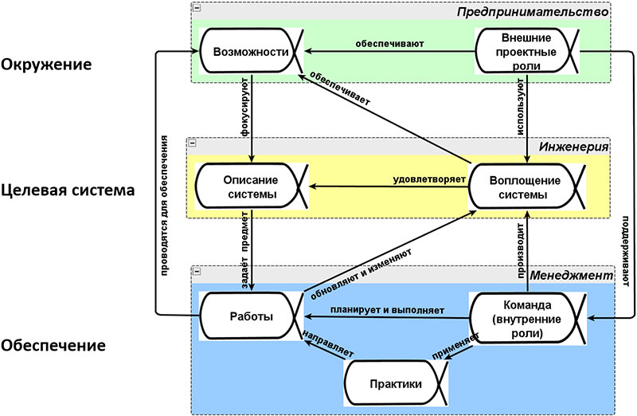

Методология Мастерской инженеров‑менеджеров опирается на общепризнанные документы. В их числе самые разные международные стандарты и публичные документы, содержащие в себе чёткие и коллективно обсуждённые формулировки и схемы тех или иных положений системного подхода.

## **ISO/IEC/IEEE 15288:2015(E)** {.h4 .mt-5}

«Systems and software engineering — System life cycle processes» – является базовым стандартом системной инженерии. Он задаёт само понятие системы и жизненного цикла, различает целевую и обеспечивающую системы, вводит понятие практик жизненного цикла.

Его свежая версия была принята в мае 2015 года, до этого была версия 2008 года. В новой версии стандарта сформулирован перечень практик (другой по сравнению с российским официальным вариантом), которые должны выполняться системными инженерами и менеджерами на всех стадиях жизни системы. И здесь речь идет не только о специфических технических практиках, но и о таких практиках, как подрядные отношения, управления проектами и портфелями, риск-менеджмент, управление человеческими ресурсами.

По сравнению с прошлой (и тем более переведённой на русский позапрошлой) версией данного стандарта среди перечня технических практик появились практики анализа бизнеса, определения <a href="https://www.youtube.com/watch?v=GaDB9MiEpnY" target="_blank">потребностей и требований</a> стейкхолдеров, управления знаниями и другие.

## **ISO/IEC/IEEE 42010:2011** {.h4 .mt-5}

«Systems and software engineering — Architecture description»: это стандарт, задающий множественность описаний в рамках деятельностного подхода. Этот стандарт задаёт «поворот мозгов» от редукционистского подхода одного всеохватного описания к системному подходу, подразумевающему множественность связанных частных описаний, документированных в различных информационных системах в соответствии с различными методами описания. Эти методы описания оформляют (frame) многообразные интересы различных стейкхолдеров.

## **OMG Essence** {.h4 .mt-5}

«Kernel and Language for Software Engineering Methods»: описание жизненного цикла как набора практик. Данный стандарт разделяет в практиках жизненного цикла абстрактные сущности дисциплин (альфы) и конкретные сущности инструментов и документов (рабочие продукты), предусматривает изменение состояний альф и рабочих продуктов по ходу жизненного цикла. Стандарт идёт дальше своих предшественников в предметной области ситуационной инженерии методов (например, ISO/IEC 24744, OMG SPEM 2.0) в том, что не только выделяет набор типов основных сущностей проекта, но и определяет их начальный набор, включающий списки контрольных вопросов к их состояниям в ходе жизненного цикла. Стандарт также предлагает облегчённый формат представления этих контрольных вопросов в виде бумажных карточек (хотя и не исключает электронной формы его поддержки).

    

        
    

    
Системная схема проекта

Стандарт ориентирован на программную инженерию, а мы используем доработку его для системной инженерии, принятую в качестве продукта <a href="https://arxiv.org/abs/1502.00121" target="_blank">Русского отделения INCOSE</a>.

## **IEC 81346-1:2009** {.h4 .mt-5}

«Industrial systems, installations and equipment and industrial products — Structuring principles and reference designations — Part 1: Basic rules» – используется для минималистичного описания структуры системы во множестве её ипостасей (функциональной-компонентной, продуктной-модульной и места) и системы обозначения сложных инженерных объектов (принципы инженерного кодирования, согласованные с понятием холона). Этот стандарт является фундаментом для управления конфигурацией в ходе жизненного цикла.

## **ISO 15926-2:2003** {.h4 .mt-5}

«Industrial automation systems and integration — Integration of life-cycle data for process plants including oil and gas production facilities — Part 2: Data model» – используется для моделирования данных развёрнутых (полных) описаний инженерных объектов. Обеспечивает федерирование развёрнутых описаний в различных информационных системах жизненного цикла. Мы используем из этого стандарта представление о материальном характере всех систем. Все системы находятся в физическом мире, что предполагает их пространственно-временнУю протяжённость. Стандарт представляет тем самым системы как 4D объекты.

## **OpenGroup ArchiMate 3.0 Specification** {.h4 .mt-5}

Cпецификация архитектурного языка для моделирования предприятий, включая их бизнес-архитектуру, деятельность команды, а также поддерживающий эту деятельность корпоративный софт, разнообразное «железо» и компьютерные сети, необходимые для работы этого софта, с учётом также и физического оборудования, а также в рамках стратегии предприятия. На сегодняшний день это самый современный и самый популярный стандарт архитектурного подхода и языка описания архитектуры предприятия, т.е. основных решений по организации предприятия, в том числе решений по стратегии, а также решений по разворачиванию поддерживающей деятельности IT и иной (например, станки) технологии.

    

        Другие стандарты и публичные документы
    

    

        

            <ul class="divided">
                <li>
                    BKCASE, Body of Knowledge and Curriculum to Advance Systems Engineering (2014).
                </li>
                <li>
                    IEC 61355-1 (2008), Classification and designation of documents for plants, systems and equipment – Part 1: Rules and classification tables.
                </li>
                <li>
                    IEC 81346 (2009), Industrial systems, installations and equipment and industrial products — Structuring principles and reference designations — Part 1: Basic rules.26
                </li>
                <li>
                    ISO/IEC/IEEE 12207 (2008) Systems and software engineering — Software life cycle processes and ISO/IEC/IEEE 15288 (2008) Systems and software engineering — System life cycle processes.
                </li>
                <li>
                    ISO 15926-2 (2003), Industrial automation systems and integration — Integration of life-cycle data for process plants including oil and gas production facilities — Part 2:Data model.
                </li>
                <li>
                    ISO/IEC 24744 (2007), Software Engineering — Metamodel for Development Methodologies.
                </li>
                <li>
                    ISO/IEC TR 24774 (2010), Systems and software engineering — Life cycle management — Guidelines for process description.
                </li>
                <li>
                    ISO/IEC/IEEE 42010 (2011) Systems and software engineering – Architecture description.
                </li>
                <li>
                    OMG BMM (2014), Business Motivation Model.
                </li>
                <li>
                    OMG SBVR (2013), Semantics of Business Vocabulary and Rules.
                </li>
                <li>
                    OMG SPEM 2.0 (2008), Software & Systems Process Engineering Metamodel.
                </li>
                <li>
                    OMG SysML (2012), Systems Modeling Language.
                </li>
                <li>
                    OpenGroupArchiMate 3.0 (2016).
                </li>
                <li>
                    SEH (2014), INCOSE Systems Engineering Handbook.
                </li>
            </ul>
        

    

Со многими из этих стандартов мы знакомим наших слушателей в рамках стажировки [«Системный менеджмент и инженерия»](/programs/orgdev?tab=3-org-dev). Для корпоративных клиентов, кроме ознакомления с данными стандартами, подбираются и рекомендуются к освоению связанные с их использованием лучшие практики.
